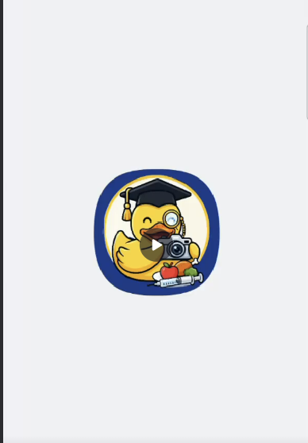
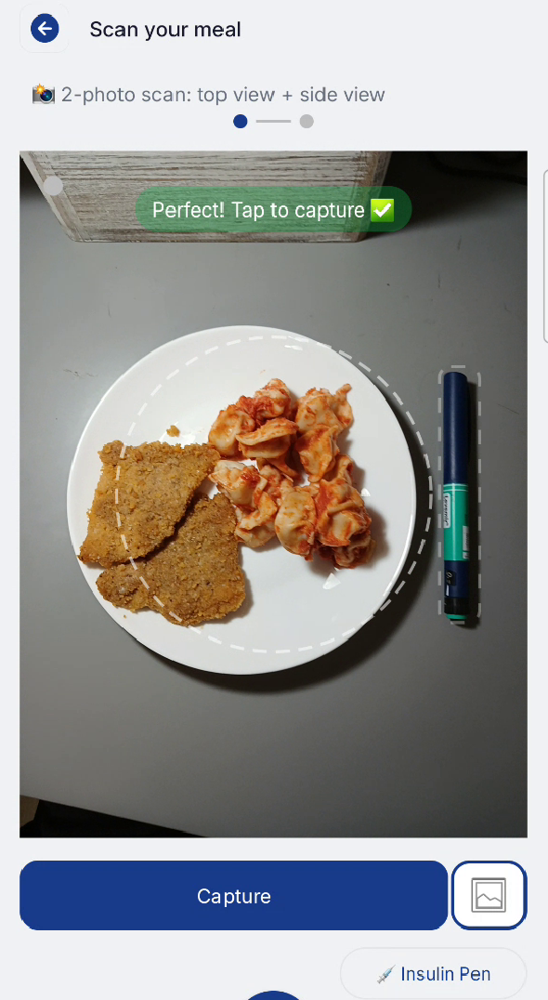
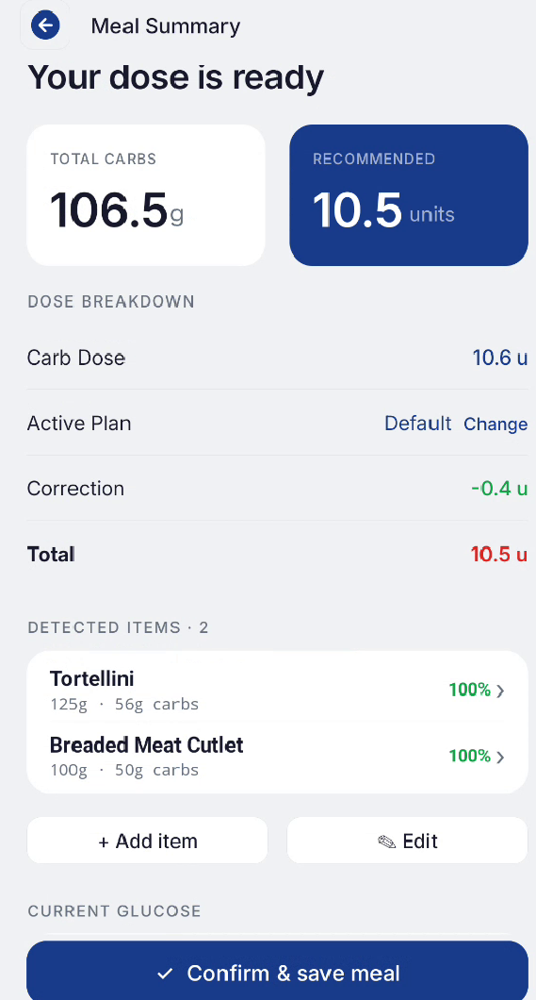
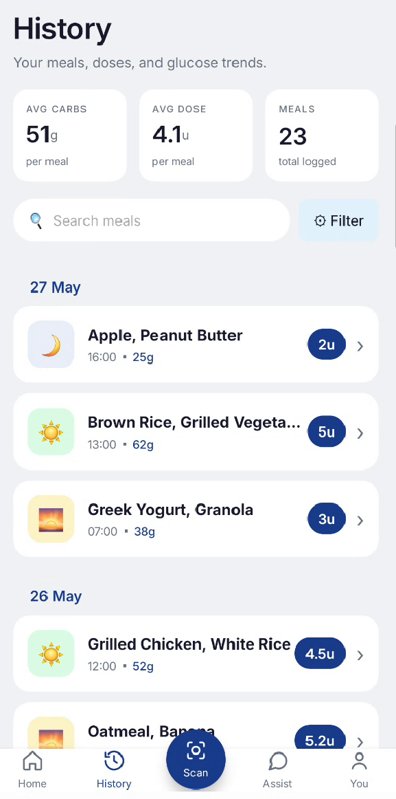

<div align="center">


# InsuScan — Android App

**AI-powered food scanning & insulin dose calculator for people with diabetes**  
Built with Kotlin · CameraX · ARCore · Firebase

[](https://kotlinlang.org/)
[-3DDC84?style=flat-square&logo=android&logoColor=white)](https://developer.android.com/about/versions/oreo)
[](https://developer.android.com/tools/releases/platforms)
[](https://firebase.google.com/)
[](https://developers.google.com/ar)
[](https://www.afeka.ac.il/)

</div>

---

## 🔗 Ecosystem

This Android app is one half of the **InsuScan** platform:

| Repository | Description | README |
|---|---|---|
| **InsuScan Android App** *(you are here)* | Kotlin Android client with CameraX, ARCore & AR depth scanning | — |
| [**InsuScan Server**](https://github.com/NimiB2/insuscan-server) | Spring Boot REST API + AI food-estimation pipeline | [View README](https://github.com/NimiB2/insuscan-server#readme) |

> 📄 **[Documentation site](https://nimib2.github.io/insuscan-server/)**

---

## 📋 Table of Contents

- [Demo](#demo)
- [Screenshots](#screenshots)
- [Overview](#overview)
- [Features](#features)
- [System Architecture](#system-architecture)
- [Technology Stack](#technology-stack)
- [Screen Flow](#screen-flow)
- [Architecture](#architecture)
- [Getting Started](#getting-started)
- [Configuration](#configuration)
- [Permissions](#permissions)
- [Project Structure](#project-structure)

---

## Demo

<div align="center">

  <a href="https://www.youtube.com/watch?v=cxkoaeEQI3A">
    
  </a>
  
</div>

---

## Screenshots

<div align="center">

<table cellpadding="14">
  <tr>
    <th align="center">Scan</th>
    <th width="24"></th>
    <th align="center">Meal Summary</th>
    <th width="24"></th>
    <th align="center">Meal History</th>
  </tr>

  <tr>
    <td align="center" valign="middle">
      
    </td>
    <td width="24"></td>
    <td align="center" valign="middle">
      
    </td>
    <td width="24"></td>
    <td align="center" valign="middle">
      
    </td> 
  </tr>
  
</table>

</div>

---

## Overview

InsuScan is an Android application designed to help people with diabetes manage their insulin doses with minimal friction.  
The user **photographs their meal** from two angles; the app captures optional ARCore depth data, sends everything to the [InsuScan Server](https://github.com/NimiB2/insuscan-server), and displays a breakdown of every food item on the plate — its estimated weight, carbohydrate content, and a personalised recommended insulin dose.

---

## Features

| Feature | Description |
|---|---|
| 📷 **Dual-angle food scan** | Top-view + side-view photos processed by the server's 11-stage AI pipeline |
| 📐 **ARCore depth integration** | Optional ARCore point-cloud data sent to the server to improve volume estimation |
| 💉 **Personalised insulin dose** | Recommendations based on the user's carb-ratio, correction factor, and target glucose |
| 📊 **Meal history** | Full history with date filtering and paginated list |
| ✏️ **Manual food entry** | Add or edit food items without scanning |
| 🔍 **AI food search** | Semantic food search backed by the USDA database |
| 🔐 **Firebase Authentication** | Email/password and Google Sign-In |
| 👤 **User profile** | Store and update personalised insulin settings |
| 💬 **Chat parse** | Conversational meal logging via text |

---

## System Architecture

<div align="center">
  
</div>

<br>

```
Android App (Kotlin)
        │
        ├── CameraX  ──► top-view.jpg ──┐
        ├── CameraX  ──► side-view.jpg ─┼──► POST /vision/v2/scan
        ├── ARCore   ──► depth.json  ───┘         │
        └── Firebase Auth (token)                  ▼
                                        InsuScan Server (:9693)
                                                  │
                               ┌──────────────────┼──────────────────┐
                               ▼                  ▼                  ▼
                        Firebase             Google              USDA Food
                        Firestore           Gemini AI             Database
                     (users & meals)    (food detection)     (nutrition data)
```

---

## Technology Stack

| Category | Library / Framework | Purpose |
|---|---|---|
| Language | Kotlin | — |
| UI | Android Views + ViewBinding | — |
| Navigation | Jetpack Navigation Component 2.9.6 | Fragment navigation & backstack |
| Camera | CameraX (camera-core, camera2, lifecycle, view) | Camera preview & photo capture |
| AR / Depth | ARCore | Real-world depth measurement |
| Computer Vision | OpenCV Android | On-device image pre-processing |
| Networking | Retrofit 2 + OkHttp + Gson | REST communication with InsuScan Server |
| Async | Kotlin Coroutines | Background operations |
| Architecture | ViewModel + LiveData | UI state management |
| Auth | Firebase Authentication + Google Sign-In | User authentication |
| Storage | Firebase Storage | Cloud image storage |
| Image Loading | Glide | Display meal images |
| Paging | Androidx Paging 3 | Paginated meal history |
| Animation | Lottie | Splash & loading animations |

---

## Screen Flow

```
Splash Screen
    └── Auth Screen (Login / Register)
            └── Home Screen
                    ├── Scan Flow
                    │       ├── Camera (top-view)
                    │       ├── Camera (side-view)
                    │       ├── AR Depth capture (optional)
                    │       └── Scan Result / Summary
                    ├── Manual Entry
                    ├── Meal History
                    │       └── Meal Detail
                    ├── Food Search (AI)
                    └── Profile
```

---

## Architecture

The app follows the **MVVM** pattern with a repository layer that abstracts all network calls.

```
UI (Fragment / Activity)
        │
        ▼
    ViewModel  ←──  LiveData / StateFlow
        │
        ▼
   Repository
        │
        ▼
   RetrofitClient  ──►  InsuScan Server (:9693)
```

Key architectural decisions:

- **ViewBinding** — type-safe view access, no `findViewById`.
- **Navigation Component** — single-activity architecture with `NavController`.
- **Coroutines** — all network calls are `suspend` functions, no callback hell.
- **ViewModel** — survives configuration changes; separates business logic from UI.

---

## Getting Started

### Prerequisites

| Requirement | Notes |
|---|---|
| Android Studio | Hedgehog (2023.1.1) or later recommended |
| JDK | 11 (set in `compileOptions`) |
| Android device or emulator | Min Android 8.0 (API 26) |
| Google Play Services | Required for ARCore and Firebase Auth |
| [InsuScan Server](https://github.com/NimiB2/insuscan-server) | Must be running and reachable |

### Clone and Open

```bash
git clone https://github.com/DanielSelas/InsuScan---AndoridApp.git
```

Open the cloned directory in **Android Studio**.

### Firebase Setup

1. Go to [Firebase Console](https://console.firebase.google.com/) and open the same project used by the server.
2. Add an **Android app** with package name `com.example.insuscan`.
3. Download `google-services.json` and place it in the `app/` directory.
4. Enable **Email/Password** and **Google** sign-in methods in **Authentication → Sign-in method**.

### Server URL

The server base URL is defined as a `BuildConfig` field in `app/build.gradle.kts`:

```kotlin
buildConfigField("String", "BASE_URL", "\"http://127.0.0.1:9693/\"")
```

> **Important:** For a physical device, replace `127.0.0.1` with the LAN IP of the machine running the InsuScan Server (e.g. `"http://192.168.1.100:9693/"`).

### Run

Select your device/emulator in Android Studio and press **Run ▶**.

---

## Configuration

| Setting | Location | Default |
|---|---|---|
| Server base URL | `app/build.gradle.kts` → `BuildConfig.BASE_URL` | `http://127.0.0.1:9693/` |
| Firebase config | `app/google-services.json` | Linked project |
| Min / Target SDK | `app/build.gradle.kts` | 26 / 35 |
| App version | `app/build.gradle.kts` → `versionName` | `1.0` |

---

## Permissions

| Permission | Reason |
|---|---|
| `INTERNET` | Network communication with InsuScan Server |
| `CAMERA` | CameraX photo capture |
| `READ_MEDIA_IMAGES` | Gallery image access |
| `android.hardware.camera` | Required camera feature |
| `android.hardware.camera.ar` | Optional — ARCore depth (not required to install) |

---

## Project Structure

```
app/src/main/java/com/example/insuscan/
│
├── InsuScanApplication.kt        # Application class
├── MainActivity.kt               # Single-activity host + NavController
├── AppForegroundObserver.kt      # Lifecycle observer for session handling
│
├── splash/                       # Splash screen (Lottie animation)
├── auth/                         # Login & registration screens
├── registration/                 # Post-signup profile setup
├── home/                         # Home dashboard
│
├── scan/                         # Dual-angle scan flow
│   ├── CameraScanFragment.kt     # Camera UI + CameraX capture
│   ├── ScanPipelineManager.kt    # Coordinates top/side capture & API call
│   ├── ScanFragment.kt           # Scan entry point
│   ├── ScanMode.kt               # Enum: TOP_VIEW / SIDE_VIEW
│   ├── ReferenceChipsController  # Reference object selector UI
│   └── coach/ notice/ helper/ ui/
│
├── ar/                           # ARCore depth integration
│   └── ArCoreManager.kt         # ARCore session + depth point-cloud capture
│
├── analysis/                     # Scan result display & editing
├── summary/                      # Post-confirmation meal summary
├── meal/                         # Meal detail view
├── history/                      # Paginated meal history
├── manualentry/                  # Manual food-item entry
├── chat/                         # Chat-based meal logging
│
├── profile/                      # User profile management
├── appdata/                      # Shared data stores (UserSession, etc.)
├── mapping/                      # Entity ↔ UI model mappers
│
├── network/                      # Networking layer
│   ├── InsuScanApi.kt            # Retrofit interface (all endpoints)
│   ├── RetrofitClient.kt         # Singleton Retrofit + OkHttp setup
│   ├── ApiConfig.kt              # Base URL from BuildConfig
│   ├── dto/                      # Request & response data classes
│   ├── repository/               # Repository implementations
│   └── exception/                # Network error handling
│
└── utils/                        # Extension functions & shared utilities

docs/                             # 📁 Place README images here
├── architecture.png              #    System architecture diagram
├── screen_scan.png               #    Screenshot: scan screen
├── screen_result.png             #    Screenshot: result screen
├── screen_history.png            #    Screenshot: history screen
├── screen_profile.png            #    Screenshot: profile screen
└── demo_thumb.png                #    Demo video thumbnail (optional)
```

---

<div align="center">

**InsuScan** — Afeka College of Engineering  
Academic project · Not for clinical use

[Server Repository](https://github.com/NimiB2/insuscan-server) · [Documentation](https://docs.insuscan.app) *(coming soon)*

</div>
